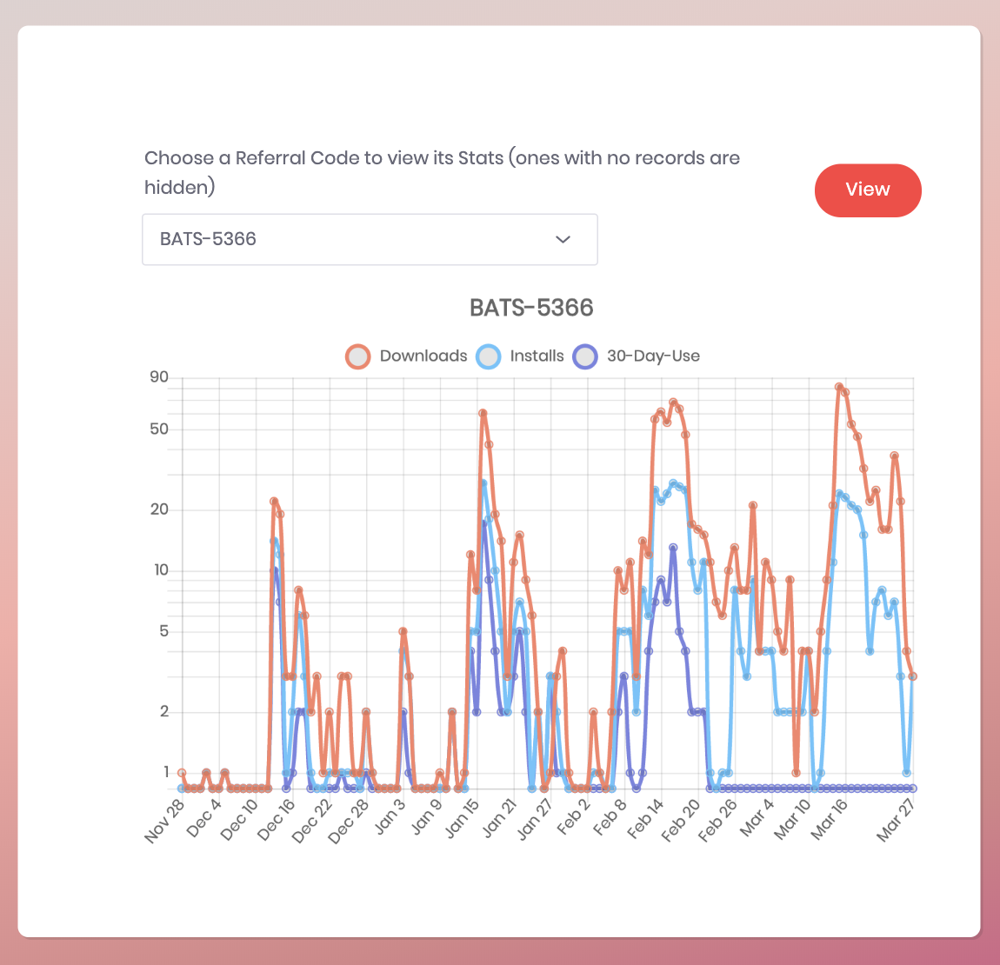

[](https://travis-ci.org/brave-intl/publishers)

## :wrench: Setup

Follow these steps to setup the App for [publishers.basicattentiontoken.org](https://publishers.brave.com). This guide presumes you are using OSX and [Homebrew](https://brew.sh/).

1. Install __Ruby 2.4.5__. For a Ruby version manager try
   [rbenv](https://github.com/rbenv/rbenv). Follow the `Installation` section instructions. Once installed run `rbenv install 2.4.5`. Be sure to restart your terminal before continuing.
2. Install __Node 6.12.3__ or greater: `brew install node`
3. Install __Postgresql 9.5+__: `brew install postgresql`
   
	If you get the error `psql: FATAL: role “postgres” does not exist`. You'll need to create the `/usr/local/opt/postgres/bin/createuser -s postgres`
4. Install __Redis__: `brew install redis`
5. Install __Ruby__ gems: `gem install bundler foreman mailcatcher`.
   - [bundler](http://bundler.io/)
   - [foreman](https://github.com/ddollar/foreman)
   - [mailcatcher](https://github.com/sj26/mailcatcher)
6. Install __[Yarn](https://yarnpkg.com/en/)__ for Node dependency management:
   `brew install yarn --without-node`
   
	__Note:__ `--without-node` avoids installing Homebrew's version of Node, which is
   desirable if you are using nvm for Node version management.
7. Install project dependencies
	- __Ruby__ dependencies: `bundle install`
		- Possible error: Nokogiri, with libxml2. Try installing a system libxml2
      with `brew install libxml2` and then
      `bundle config build.nokogiri --use-system-libraries` then again
      `bundle install`.,.
	- __Node__ dependencies: `yarn --frozen-lockfile`
8. (Optional) Get an `env.sh` file from another developer which contains development-mode bash env exports and `source` that file. You can start developing without this, but some functionality may be limited.
9. Install __Rails__: `gem install rails` Be sure to restart your terminal before continuing.
10. Setup SSL as described below.

### HTTPS Setup

Local development of brave-intl uses HTTPS. This allow us to use web APIs such
as U2F in development.

If you already have a key and certificate for the `localhost` domain place them in the
`ssl/` directory:

```
ssl/server.key
ssl/server.crt
```

If you don't, you will need to generate certificates for this domain:

```
bundle exec rake ssl:generate
```

When you first visit the application in a browser you may need to add an
exception to trust this self-signed certificate. Sometimes this is under an
"advanced" or "proceed" link.

### Run

1. Start __Postgres__ and __Redis__: `brew services start redis postgresql`
2. Create and initialize the database:
```
rails db:create RAILS_ENV=development
rails db:migrate RAILS_ENV=development
```

__Note__: If you receive a `fatal-role` error, try running `/usr/local/opt/postgres/bin/createuser -s postgres` due to being installed from `homebrew`. Further documentation is [here.](https://stackoverflow.com/questions/15301826/psql-fatal-role-postgres-does-not-exist)

3. Run Rails server and async worker: `foreman start -f Procfile.dev`

4. Visit https://localhost:3000

5. To test email, run a local mail server with: `mailcatcher`

6. To view the emails sent to your inbox visit: http://localhost:1080

## API Setups

### Google API Setup

Setup a google API project:

* Login to your google account (dev), or the Brave google account (staging, production)
* Go to [https://console.developers.google.com](https://console.developers.google.com)
* Select "Create Project" then "Create" to setup a new API project
* Give the project a name such as "publishers-dev"
* Select "+ Enable APIs and Services"
* Enable "Google+ API" and "YouTube Data API v3"
* Back at the console select Credentials, then select the "OAuth consent screen" sub tab
* Fill in the details. For development you need the Product name, try "Publishers Dev (localhost)"
* Then Select "Create credentials", then "OAuth client ID"
  * Application type is "Web application"
  * Name is "Publishers"
  * Authorized redirect URIs is `http://localhost:3000/publishers/auth/google_oauth2/callback`
  * select "Create"
* Record the Client ID and Client secret and enter them in your Env variables
* Back at the console select "Create credentials" and select API key.  This will be used for youtube channel stats via the data api.
* Record the API and enter it in your Env variables

You may need to wait up to 10 minutes for the changes to propagate.

These steps based on [directions at the omniauth-google-oauth2 gem](https://github.com/zquestz/omniauth-google-oauth2#google-api-setup).

### Twitch API Setup

Setup a twitch API project:

* Login to your Twitch account (dev), or the Brave Twitch account (staging, production)
* Go to [https://dev.twitch.tv/dashboard](https://dev.twitch.tv/dashboard)
* Select "Get Started" for "App"
* Give the project a name such as "publishers-dev"
* Give the app a name and application category.
* Use the redirect URI `https://localhost:3000/publishers/auth/register_twitch_channel/callback` in development.
* Create a Client ID and secret, saving each of them.
  * Update your env to include `TWITCH_CLIENT_ID="your-app-id"`
  * Update your env to include `TWITCH_CLIENT_SECRET="your-app-secret"`
* Save the app

### Twitter API Setup

* Apply for a developer account at [developer.twitter.com](https://developer.twitter.com/)
* Select "Create an App"
* Give the app a name like "Brave Payments Dev"
* Make sure "Enable Sign in with Twitter" is checked
* Set the callback url to `https://localhost:3000/publishers/auth/register_twitter_channel/callback`.  If it does not allow you to set `localhost`, use a place holder for now, and later add the correct callback url through apps.twitter.com instead.
* Fill in the remaining information and hit "Create"
* Navigate to your app settings -> permissions and ensure it is readonly and requests the user email
* Regenerate your Consumer API keys
* Update your env to include `TWITCH_CLIENT_ID="your-api-key"` and `TWITTER_CLIENT_SECRET="your-api-secret-key"`
* Save

### reCAPTCHA Setup

In order to test the rate limiting and captcha components you will need to setup an account with Google's
[reCAPTCHA](https://www.google.com/recaptcha/intro/android.html). Instructions can be found at the
[reCAPTCHA gem repo](https://github.com/ambethia/recaptcha#rails-installation). Add the api keys to your Env variables.

### Local Eyeshade Setup

1. Follow the [setup instructions](https://github.com/brave-intl/bat-ledger) for bat-ledger
2. Add `export API_EYESHADE_BASE_URI="http://127.0.0.1:3002"` to your secrets script
3. Add `export API_EYESHADE_KEY="00000000-0000-4000-0000-000000000000"` to your secrets script

To stop using Eyeshade locally, set `API_EYESHADE_BASE_URI=""`.

### Local Vault-Promo-Services Setup

1. Request access to [Vault-Promo-Services](https://github.com/brave-intl/vault-promo-services) and [ip2tags](https://github.com/brave-intl/vault-promo-services)
2. Follow the [setup instructions](https://github.com/brave-intl/vault-promo-services)
3. Create and run a `vault-promo-services.sh` start script like this 
```
export DATABASE_URL="services"
export PGDATABASE="services"
export AUTH_TOKEN=1234
export S3_KEY="X"
export S3_SECRET="x"
export WINIA32_DOWNLOAD_KEY="/"
export WINX64_DOWNLOAD_KEY="/"
export OSX_DOWNLOAD_KEY="/"
export TEST=1

dropdb services
createdb services
for folder in ./migrations/*; do
  psql services < ${folder}/up.sql
done
npm start
```

* If you run into an issue about a missing `.mmdb` file, run `fetch.sh` in `node_modules/ip2tags`

4. Add the following into your Publishers start script 
```
export API_PROMO_BASE_URI="http://127.0.0.1:8194" 
export API_PROMO_KEY="1234"
```

## Development

### Config

Configuration is set in [config/secrets.yml](https://github.com/brave/publishers/blob/master/config/secrets.yml) via environment variables.

It might be useful to maintain a local bash script with a list of env vars. For an example see [config/secrets.yml](https://github.com/brave/publishers/blob/master/docs/publishers-secrets.example.sh).

#### Automagic addon vars

Some variables are set automagically with Heroku addons:

- `MAILGUN_*` - For sending emails.
- `NEW_RELIC_APP_NAME`, `NEW_RELIC_LICENSE_KEY` - New Relic app monitoring.
- `REDIS_URL` - For Sidekiq and rack-attack

### Generating Referral Charts

As part of a view we have a chart on the dashboard. There isn't an easy way to mock this out, so there is a rake task to allow developers to easily test this locally.

You must first have a channel added and the promo activated for this to work.

```sh
rails database_updates:mock_data:populate_promo_stats
```




#### Other vars

A few variables are not configured in secrets.yml: currently none

## Linting

For Ruby we use [rubocop](https://github.com/rubocop-hq/rubocop) to standardize our project. Our linter config is based upon the [AirBnb style guide](https://github.com/airbnb/ruby).

To run simply open the project and run in the terminal

```sh
bundle exec rubocop
```

For Typescript/Stylesheets we use [tslint](https://palantir.github.io/tslint/) and [stylelint](https://github.com/stylelint/stylelint) respectively.

To run simply open the project and run in the terminal

```sh
yarn lint
```


## Testing

### Ruby

```sh
bin/rake test
```

We use capybara which runs selenium tests, which depends on chromium.
If you don't installed, you'll get an error "can't find chrome binary".
On debian you can install it like:

```sh
sudo apt-get install chromium
```
And on mac with:

```
brew cask install chromium
```

We also use ImageMagick to process user uploaded images. If you don't have it already, you might get an error "You must have ImageMagick or GraphicsMagick installed".  You can install on mac with:

```
brew install imagemagick
```

### Javascript

We use jest for our javascript testing framework. You can run the tests through the following command.

```sh
yarn test
```

## Running locally with docker-compose

First, [install docker and docker compose](https://docs.docker.com/compose/install/).

Check out [publishers](https://github.com/brave-intl/publishers).

In a sibling directory check out [bat-ledger](https://github.com/brave-intl/bat-ledger).

You can add any environment variables that need to be set by creating a `.env`
file at the top of the repo. Docker compose will automatically load from this
file when launching services.

e.g. you might have the following in `.env`:
```
BAT_MEDIUM_URL=https://medium.com/@attentiontoken
BAT_REDDIT_URL=https://www.reddit.com/r/BATProject/
BAT_ROCKETCHAT_URL=https://basicattentiontoken.rocket.chat/
BAT_TWITTER_URL=https://twitter.com/@attentiontoken
DEFAULT_API_PAGE_SIZE=600

GOOGLE_AUTH_PROVIDER_X509_CERT_URL=https://www.googleapis.com/oauth2/v1/certs
GOOGLE_AUTH_URI=https://accounts.google.com/o/oauth2/auth
GOOGLE_CLIENT_ID=somelongkey.apps.googleusercontent.com
GOOGLE_CLIENT_SECRET=mysecret
GOOGLE_PROJECT_ID=bravedev-184414
GOOGLE_TOEKN_URI=https://accounts.google.com/o/oauth2/token

RECAPTCHA_PRIVATE_KEY=my_recaptcha_key
RECAPTCHA_PUBLIC_KEY=my_recaptcha_publickey
RECAPTCHA_SECRET_KEY=my_recaptcha_secretkey
RECAPTCHA_SITE_KEY=my_recaptcha_sitekey

SENDGRID_API_KEY=SG.toke
SENDGRID_PUBLISHERS_LIST_ID=3986776

TWITCH_CLIENT_ID=twitch_client_id
TWITCH_CLIENT_SECRET=my_twitch_secret

UPHOLD_API_URI=https://api-sandbox.uphold.com
UPHOLD_CLIENT_ID=my_dev_uphold_client_id
UPHOLD_CLIENT_SECRET=my_dev_uphold_client_secret
UPHOLD_PROVIDER=api-sandbox.uphold.com
UPHOLD_SCOPE=cards:read,user:read,transactions:transfer:others

```

If you wish to make modifications to the compose files you can place a file named `docker-compose.override.yml` at the
top of the repo. For example you can expose ports on your system for the databases with this
`docker-compose.override.yml`:

```yaml
version: "2.1"

services:
  mongo:
    ports:
      - "27017:27017"
  redis:
    ports:
      - "6379:6379"
  postgres:
    ports:
      - "5432:5432"
```

to start with docker build the app and eyeshade images
```sh
docker-compose build
```

and bring up the full stack
```sh
docker-compose up
```

### Create the databases
```sh
docker-compose run app yarn install; docker-compose run app rake db:setup; docker-compose run eyeshade-worker sh -c "cd eyeshade && ./bin/migrate-up.sh"
```

### Adding balances to Eyeshade

By default when you create a channel it will not have a balance on Eyeshade, the accounting server.  To test wallet code with non nil balances, you must add them first.

To add a contribution to a channel account:
```
rails "docker:add_contribution_balance_to_account[youtube#channel:UCOo92t8m-tWKgmw276q7mxw, 200]" # Adds 200 BAT to youtube#channel:UCOo92t8m-tWKgmw276q7mxw
```

To add add a referral balance to an owner account:
```
rails "docker:add_referral_balance_to_account[publishers#uuid:967a9919-34f4-4ce6-af36-e3f592a6eab7, 400]" # Adds 400 BAT to youtube#channel:UCOo92t8m-tWKgmw276q7mxw
```

The new balance should be reflected on the dashboard.

### Run Tests

Tests can be run on the container with
```sh
docker-compose run app rake test
```

Other one off commands can be run as above, but replacing `rake test`. Note this spawns a new container.

### Debugging
Debugging with byebug and pry can be done by attaching to the running process. First get the container
id with `docker ps`

```sh
docker ps
CONTAINER ID        IMAGE                    COMMAND                  CREATED                  STATUS              PORTS                                            NAMES
234f116cd942        publishers_app           "foreman start --pro…"   Less than a second ago   Up 2 seconds        0.0.0.0:3000->3000/tcp                           publishers_app_1
b592d489a8d3        redis                    "docker-entrypoint.s…"   15 minutes ago           Up 3 seconds        6379/tcp                                         publishers_redis_1
f1c86172def7        schickling/mailcatcher   "mailcatcher --no-qu…"   15 minutes ago           Up 2 seconds        0.0.0.0:1025->1025/tcp, 0.0.0.0:1080->1080/tcp   publishers_mailcatcher_1
```

Then attach to the container and you will hit your `binding.pry` breakpoints

```sh
docker attach 234f116cd942
```

To connect with a bash shell on a running container use:
```sh
docker exec -i -t 234f116cd942 /bin/bash
root@234f116cd942:/var/www#
```
