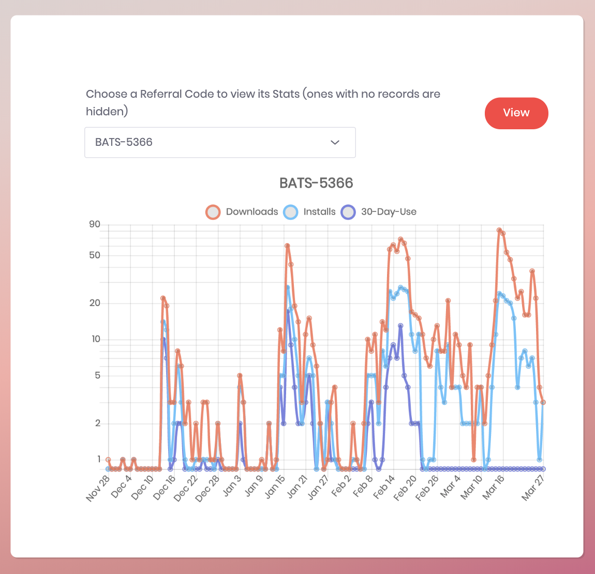

### Generating Referral Charts

As part of a view we have a chart on the dashboard. There isn't an easy way to mock this out, so there is a rake task to allow developers to easily test this locally.

You must first have a channel added and the promo activated for this to work.

```sh
rails database_updates:mock_data:populate_promo_stats
```


